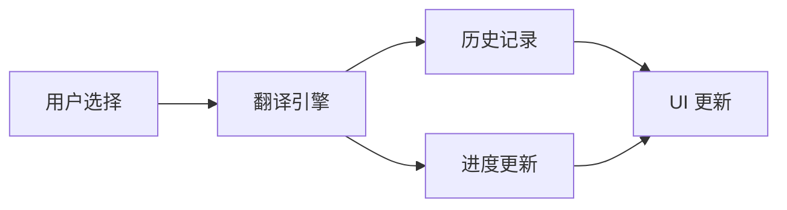

# Figma Translator 产品文档

## 产品概述

Figma Translator 是一款基于 AI 技术的 Figma 翻译插件，专注于提供高效、准确的文本翻译服务。插件支持批量翻译、历史记录管理、进度跟踪等功能，帮助设计师快速完成多语言设计工作。

## 核心功能

### 1. 翻译功能
- **批量翻译**
  - 支持选择多个文本图层
  - 保持原始样式和布局
  - 自动克隆原始图层
  
- **翻译引擎**
  - 支持 OpenAI API
  - 支持 Deepseek API
  - 可扩展的 API 架构

### 2. 历史记录
- **记录管理**
  - 自动保存翻译历史
  - 支持搜索和筛选
  - 记录详细的翻译信息
  
- **重新生成**
  - 支持从历史记录重新生成翻译
  - 保持原始样式和位置
  - 智能节点匹配

### 3. 进度管理
- **进度跟踪**
  - 实时进度条显示
  - 详细的状态信息
  - 错误提示和处理
  
- **批量处理**
  - 队列管理
  - 并发控制
  - 失败重试机制

## 技术实现

### 1. 架构设计
- **前端架构**
  - React 组件化开发
  - TypeScript 类型系统
  - Webpack 构建优化
  
- **后端服务**
  - API 适配器模式
  - 本地存储管理
  - 状态管理系统

### 2. 核心模块
- **翻译引擎**
  ```typescript
  interface TranslationEngine {
    translate(text: string): Promise<string>;
    validateConfig(): boolean;
    getSupport
edLanguages(): string[];
  }
  ```

- **历史记录管理**
  ```typescript
  interface TranslationRecord {
    id: string;
    timestamp: number;
    sourceText: string;
    translatedText: string;
    metadata: RecordMetadata;
  }
  ```

- **进度管理器**
  ```typescript
  interface ProgressManager {
    updateProgress(percent: number, message: string): void;
    complete(): void;
    error(message: string): void;
  }
  ```

### 3. 数据流


## 性能优化

### 1. 构建优化
- 代码分割
- 资源压缩
- 缓存策略

### 2. 运行时优化
- 批量处理
- 内存管理
- 响应式更新

## 安全考虑

### 1. API 安全
- 密钥管理
- 请求限制
- 错误处理

### 2. 数据安全
- 本地存储加密
- 敏感信息处理
- 权限控制

## 后续规划

### 1. 功能扩展
- SVG 生成工具
- 多语言支持
- 团队协作功能

### 2. 性能提升
- 更智能的缓存
- 更快的响应速度
- 更低的资源消耗

### 3. 用户体验
- 更直观的界面
- 更多的自定义选项
- 更完善的错误提示 